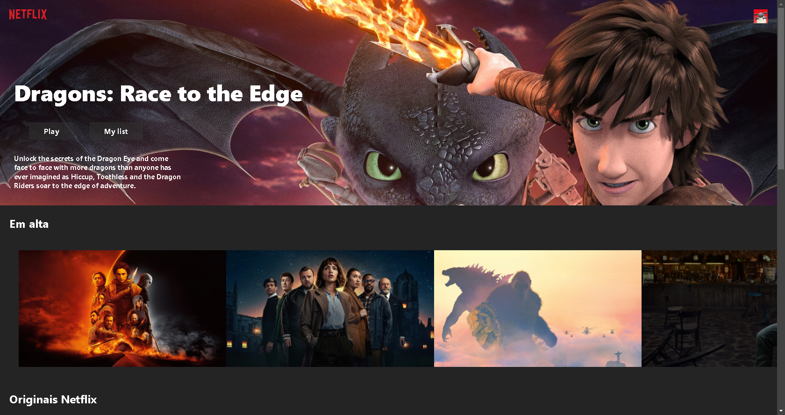

# Clone Netflix

Um clone da netflix usando e React + Vite. Projeto que exibe os trending tops em uma pagina inicial semelhante a da Netflix. Foi usado a api da [TheMovieDB](https://www.themoviedb.org/).



## Instalação

Para executar este projeto localmente, siga estas etapas:

1. Clone o repositório para o seu ambiente local:

    ```
    git clone https://github.com/kauamntro/netflix-clone.git
    ```

2. Instale as dependências do projeto:

    ```
    npm install
    ```

3. Execute o projeto:

    ```
    npm run dev
    ```
## Me siga

[Linkedin](https://www.linkedin.com/in/kauamntro/) e [Instagram](https://www.instagram.com/code.kaua/)
